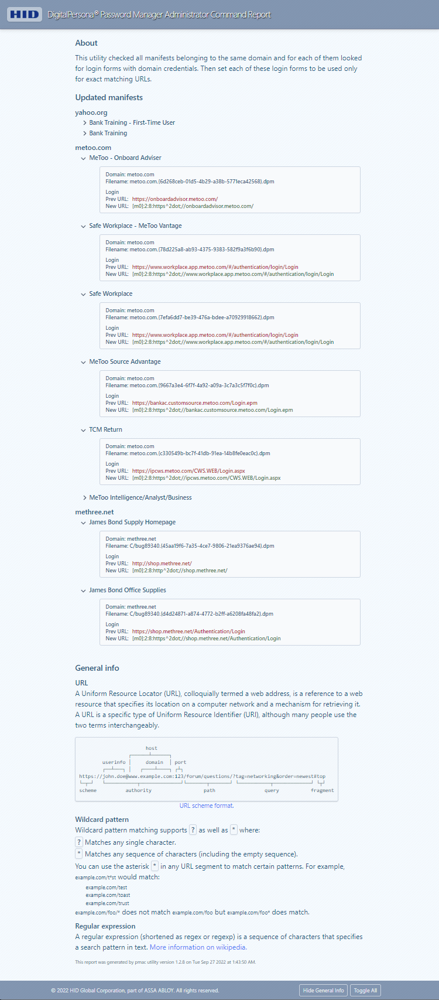

#### About

The **pmac** utility converts PM manifests with domain credentials to manifests with credentials that apply only to a specific URL.

Find all manifests that belong to the same domain and for them look for login forms with domain credentials. 
Then set each of these login forms to be used only for exact matching URLs. 

This utility will not take into account password change forms.

<!-- You can click the list item to check the details. -->

<!--
Password manager domain credential switch utility.

This utility program checked all manifests that belong to the same domain and for them looked for login forms with domain credentials.
This utility program checked all manifests belonging to the same domain and for them looked for login forms for them with domain credentials.
This utility checked all manifests belonging to the same domain and for them looked for login forms for them with domain credentials.
This utility checked all manifests belonging to the same domain and for each of them looked for login forms with domain credentials.
This utility program checked all manifests belonging to the same domain and looked for login forms for them with domain credentials.

This utility checked all manifests belonging to the same domain and for each of them looked for login forms with domain credentials.

This utility program will find all manifests that belong to the same domain and for them look for login forms with domain credentials.

You can undo taken action by copiyng files from backup folder to the original place

This utility was started as: "...".

The list of updated files is splitted inot groups by domain.

add button:  more ...
-->